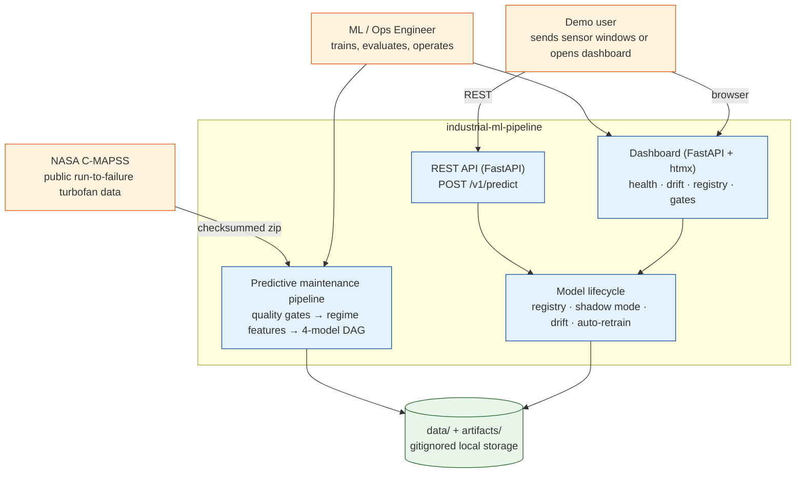
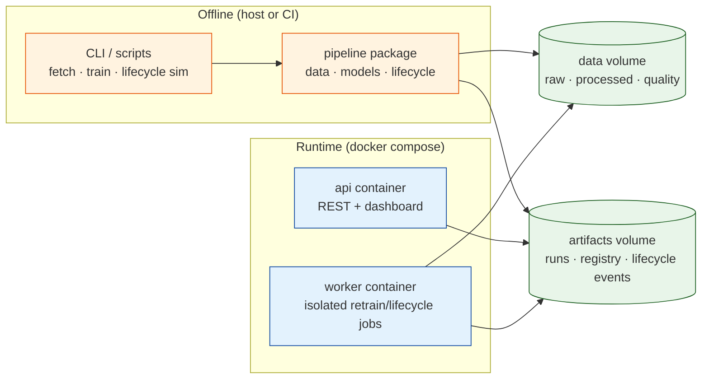
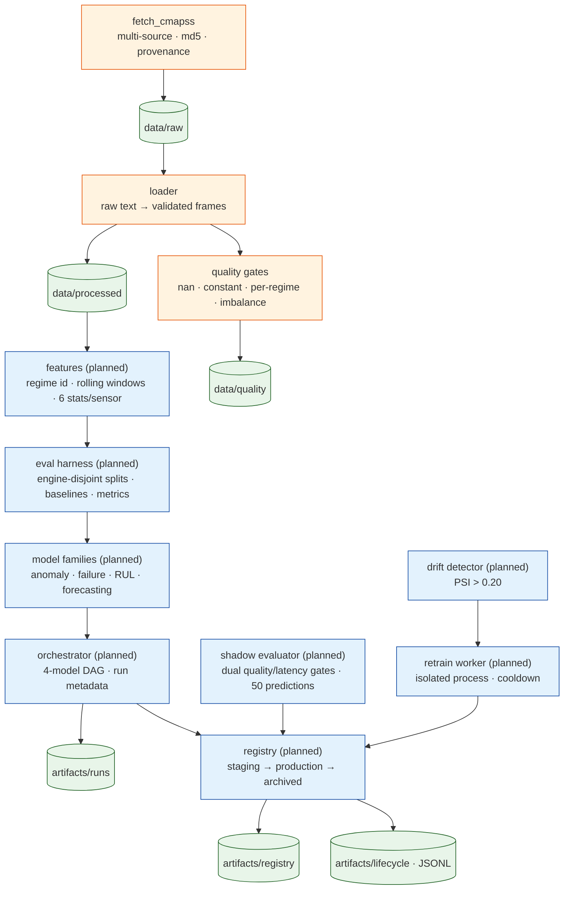
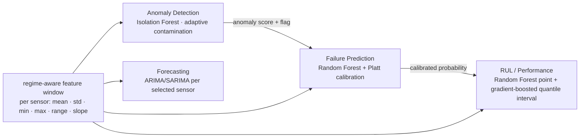
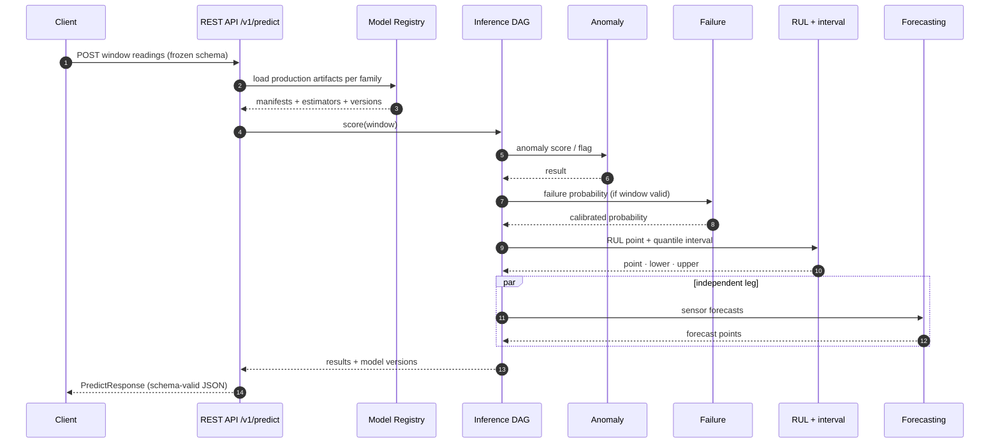
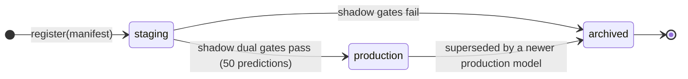
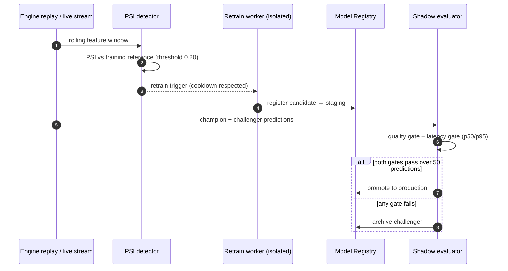
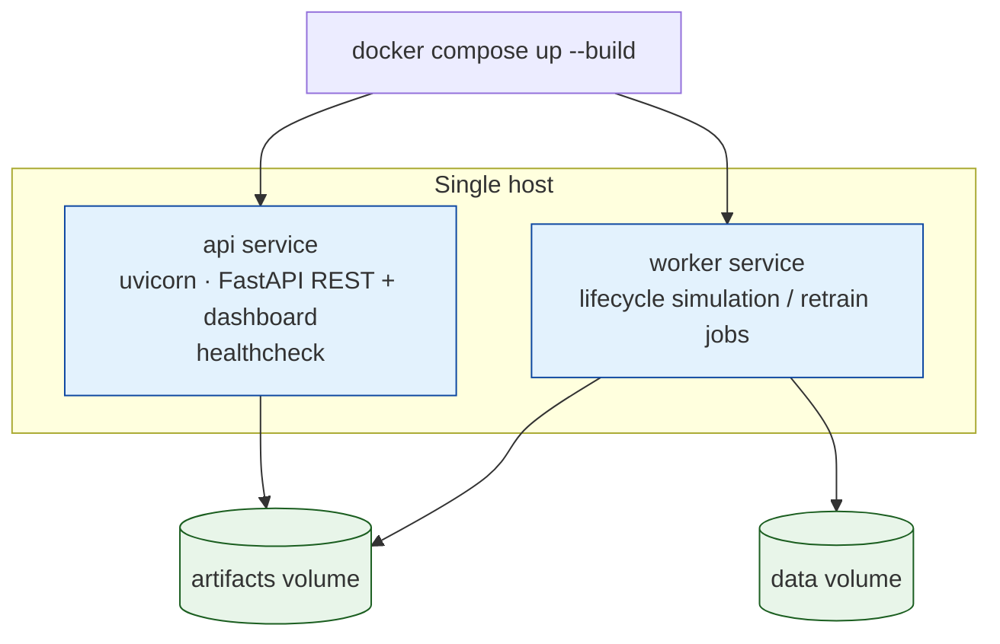

# System Architecture — `industrial-ml-pipeline`

## Purpose

This document is the living architecture reference for the project: an
end-to-end predictive-maintenance pipeline on the NASA C-MAPSS turbofan
dataset. It describes the system's containers, components, data flows, model
lifecycle, serving surface, and deployment topology. Diagrams reflect
decisions that are already frozen (interface contracts, data-layer behavior,
model DAG topology); components that are still under construction are marked
*planned*.

All design decisions trace to requirement IDs (FR-xx) defined in the
development plan.

## 1. Dependency Inventory

Versions marked *pinned* are declared in `pyproject.toml` and their official
docs were fetched during implementation (ADR 0002). Versions marked *planned*
were researched during design; exact pins are added when the feature that uses
them is implemented.

| Dependency | Version | Official docs URL | Verified? | Key facts |
|------------|---------|-------------------|-----------|-----------|
| numpy | 2.4.3 (pinned) | numpy.org/doc/stable | yes | Python ≥3.11; `default_rng(seed)` is the recommended generator constructor |
| pandas | 3.0.5 (pinned) | pandas.pydata.org/docs | yes | `read_csv(sep=r"\s+")`, `to_parquet(engine='auto')`, `read_parquet` |
| pyarrow | 25.0.1 (pinned) | arrow.apache.org/docs | yes | Parquet backend for pandas; `read_table`/`write_table` confirmed |
| pydantic | 2.13.5 (pinned) | docs.pydantic.dev/2.13 | yes | v2 models, `Field`, `model_validator`, `TypeAdapter` for unions |
| pydantic-settings | 2.15.0 (pinned) | docs.pydantic.dev/2.13 | yes | `BaseSettings`, `env_prefix`, `env_file`, `extra="ignore"` |
| pytest | 9.1.1 (pinned) | docs.pytest.org/stable | yes | fixtures, `tmp_path`, scoped sharing |
| ruff | 0.16.5 (pinned) | docs.astral.sh/ruff | yes | config via `[tool.ruff.lint]` |
| scikit-learn | 1.9.0 (planned) | scikit-learn.org/stable | yes | IsolationForest, RandomForest, `CalibratedClassifierCV` (Platt/sigmoid) |
| scipy | 1.17.1 (planned) | docs.scipy.org/doc/scipy | yes | Python ≥3.11 pin (1.18+ requires 3.12); stats for PSI binning |
| statsmodels | 0.15.0 (planned) | statsmodels.org/stable | yes | ARIMA fallback |
| pmdarima | 2.1.1 (planned) | alkaline-ml.com/pmdarima | yes | AutoARIMA with seasonal detection |
| fastapi | 0.141.1 (planned) | fastapi.tiangolo.com | yes | REST framework; OpenAPI from pydantic models |
| uvicorn | 0.52.4 (planned) | uvicorn.dev | docs host unreachable from sandbox; GitHub README + PyPI verified | ASGI server; re-verify when the serving milestone starts (MEDIUM risk) |
| jinja2 | 3.1.6 (planned) | jinja.palletsprojects.com | yes | htmx dashboard templates |

## 2. Architecture Overview

### 2.1 System Context (C4 Level 1)

### 2.2 Containers (C4 Level 2)

Two runtime containers plus offline tooling, sharing two data volumes.

### 2.3 Offline Pipeline Components

### 2.4 Model DAG

Four model families form the inference DAG. Anomaly detection runs first;
failure prediction and RUL estimation consume the same feature window;
forecasting runs independently.

### 2.5 Serving Flow

### 2.6 Registry Lifecycle

### 2.7 Drift → Retrain → Shadow Loop

## 3. Technology Choices

| Choice | Rationale | Requirement |
|--------|-----------|-------------|
| Python 3.11+, pydantic contracts | Validated boundaries; frozen schemas prevent cross-module drift | FR-16 |
| pandas + pyarrow | Tidy per-subset Parquet with provenance manifests | FR-01, FR-16 |
| scikit-learn | IsolationForest, RandomForest, Platt calibration in one stable API | FR-05, FR-06, FR-07 |
| Gradient-boosted quantile losses for RUL intervals | Calibrated uncertainty on a classical base estimator | FR-07 |
| pmdarima/statsmodels | Auto ARIMA/SARIMA order selection per sensor | FR-08 |
| FastAPI (REST only) | Schema-first contract already frozen in pydantic; automatic OpenAPI | FR-13 |
| htmx dashboard on FastAPI | Live operational view without a JS build step | FR-14 |
| Docker Compose | One-command local deployment with shared data/artifact volumes | FR-15 |
| Exact version pins | Reproducibility (ADR 0002) | FR-16 |

## 4. API-First Design

- **Contract source**: the pydantic models in `pipeline/schemas/api.py` are the
  frozen contract; FastAPI derives OpenAPI from them (schema-first, not
  code-first). FR-13.
- **Versioning**: URI prefix `/v1/`. Additive changes stay on `/v1/`;
  breaking changes introduce `/v2/`.
- **Endpoints**:
  - `POST /v1/predict` — chronological sensor window → anomaly, failure,
    RUL interval, optional forecasts, model versions, latency. (FR-13)
  - `GET /health` — liveness + pipeline health summary. (FR-14)
  - `GET /v1/models` — registry inventory for serving. (FR-10, FR-13)
  - Dashboard routes and htmx partials. (FR-14)
- **Errors**: RFC 7807 Problem Details shape
  (`type`, `title`, `status`, `detail`, `instance`) for all non-2xx
  responses; FastAPI's default validation errors are mapped to this envelope
  in the serving layer.
- **Pagination / filtering**: not applicable to the predict endpoint; any
  list endpoint (e.g., registry or event history) uses explicit
  limit/offset with documented defaults.
- **Idempotency**: prediction is a read-style operation; clients may submit a
  `request_id` echoed in the response for correlation. No write endpoints
  exist in the demo scope.
- **Rate limiting / auth**: out of scope for the local portfolio demo
  (documented as a deployment decision, not an omission).

## 5. Data Storage Strategy

- Raw data: checksummed archive in `data/raw/` (gitignored). Provenance JSON
  records source, checksum, and attempt history (FR-01, FR-16).
- Processed data: tidy Parquet per subset plus a dataset manifest
  (`subset`, columns, row/engine counts, provenance) in `data/processed/`.
- Quality reports: JSON per subset in `data/quality/`.
- Model artifacts: self-describing joblib files with an embedded JSON
  manifest (estimator, scaler, features, thresholds, metrics, git SHA).
- Registry index: **open decision** — default is a SQLite index over the
  self-describing artifacts (documented in the ADR when decided); a
  filesystem JSON index is the fallback. The registry protocol is frozen, so
  the backend is swappable. FR-10.
- Lifecycle events: append-only JSONL under `artifacts/lifecycle/` so the
  dashboard and audits can replay the full history. FR-11, FR-12.

No database is required to run the pipeline locally; all storage is
file-backed and gitignored.

## 6. Caching Strategy

- Production artifacts are loaded into memory at API startup and cached per
  family until a registry promotion event invalidates them.
- Feature snapshots (training reference distributions for PSI) are cached in
  memory and versioned with the model that trained on them.
- No external cache (Redis, etc.) is needed at this scale; a cache would sit
  between the API and the registry only if artifact loads become the
  bottleneck.

## 7. Error Handling

- Schema violations fail at module boundaries via pydantic validation
  (`extra="forbid"` catches drift). FR-16.
- Data quality failures block training with structured reports (ADR 0005);
  advisory warnings flow downstream. FR-02.
- Registry violations raise typed errors; illegal stage transitions are
  impossible by design. FR-10.
- Inference on out-of-distribution windows is never silent: anomaly flags and
  PSI warnings are part of the response/dashboard surface so consumers see
  confidence context. FR-05, FR-12.
- Worker isolation: retraining runs in a separate process so inference
  latency is not affected. FR-12.

## 8. Observability

- **Metrics**: per-request latency (p50/p95) and error counts on the serving
  path; per-evaluation quality metrics (Brier, log loss, RMSE, interval
  coverage) recorded in artifact manifests; PSI values per feature in drift
  reports. FR-04, FR-11, FR-12.
- **Logging**: structured JSON lines (stdlib `logging` formatter) with
  `request_id`, `run_id`, and `artifact_id` correlation fields.
- **Events**: lifecycle JSONL is the audit trail for drift, retraining,
  shadow evaluation, and stage transitions. FR-10/11/12.
- **Dashboard panels**: registry table (family, version, stage, metrics),
  per-feature PSI, gate history, recent predictions, health/latency.
  FR-14.
- **Alerting**: not applicable to the local demo; SLO burn-rate alerting is
  noted for a hosted deployment.

## 9. Deployment Architecture

- **Topology**: single-host Docker Compose (local portfolio demo). No cloud
  infrastructure; IaC is intentionally out of scope and would be added only
  for a hosted deployment.
- **CI**: lint → test on Python 3.11/3.12 in GitHub Actions; the data layer
  tests run on synthetic fixtures so CI never depends on the 12 MB download.
- **Environments**: dev and CI today. Staging/production parity is a hosted
  deployment concern.
- **Release strategy**: not applicable locally; registry promotion is the
  model-release mechanism and is fully reversible via archive/history.

## 10. Security and Authentication

- Local demo: no authentication, no secrets, no network exposure beyond
  localhost. Docker runs non-root.
- The dataset is public NASA data; attribution and license notes live in the
  README. No proprietary data or code is included.
- For a regulated deployment, authentication/authorization and audit
  requirements would be added at the API layer without changing the frozen
  schema contracts.

## 11. Traceability Matrix

| Requirement | Components | Design decision | Rationale |
|-------------|-----------|-----------------|-----------|
| FR-01 | fetch script, loader | Checksummed multi-source acquisition; validated parsing | Reproducible, layout-safe ingestion |
| FR-02 | quality gates | Pass/warn/fail semantics | Stop on poison, defer to feature pipeline |
| FR-03 | features (planned) | Regime id + rolling 6-stat windows | Multi-regime FD002 normalization |
| FR-04 | eval harness (planned) | Engine-disjoint splits, baselines, pre-committed metrics | No temporal leakage, honest evaluation |
| FR-05 | anomaly model | Isolation Forest, adaptive contamination | Unsupervised early-warning signal |
| FR-06 | failure model | RF + Platt calibration | Calibrated probabilities for gates |
| FR-07 | RUL model | RF point + gradient-boosted quantile interval | Point estimate with uncertainty |
| FR-08 | forecasting | Auto ARIMA/SARIMA per sensor | Independent trend leg |
| FR-09 | orchestrator | anomaly → failure → RUL; forecasting parallel | 4-model DAG topology |
| FR-10 | registry | Frozen protocol; staging/production/archived | Auditability; backend swappable |
| FR-11 | shadow evaluator | Dual quality/latency gates over 50 predictions | Data-driven promotion |
| FR-12 | drift + retrain worker | PSI > 0.20, isolated worker, cooldown | Production-safe auto-retraining |
| FR-13 | REST API | /v1/ schema-first pydantic contract | Stable, OpenAPI-documented interface |
| FR-14 | dashboard/health | htmx panels over registry/drift/events | Operational visibility |
| FR-15 | Docker Compose | api + worker services, shared volumes | One-command run |
| FR-16 | packaging/config | Exact pins, seeds, checksums, provenance | Reproducibility |
| FR-17 | tests | Synthetic fixtures + module tests | Fast, offline, deterministic |
| FR-18 | docs | This document, README, model cards | Defensible public portfolio |

## 12. Pre-condition Map

- Python 3.11+ with an arm64/x86_64 wheel-compatible environment; Docker for
  the compose path.
- The NASA C-MAPSS archive is reachable from at least one of the two
  configured sources (NASA data.gov, PCoE Zenodo mirror).
- uvicorn docs host was unreachable from this environment; the GitHub README
  and PyPI metadata were used instead. Re-verify at the serving milestone.
- scipy is pinned to 1.17.1 (latest supporting Python 3.11); scipy 1.18+
  requires 3.12 and would require a project floor bump.
- The registry index backend remains an open decision; the protocol is frozen
  so implementation can proceed either way.
- Acceptance thresholds are committed at the evaluation-harness milestone,
  after baselines are measured.
